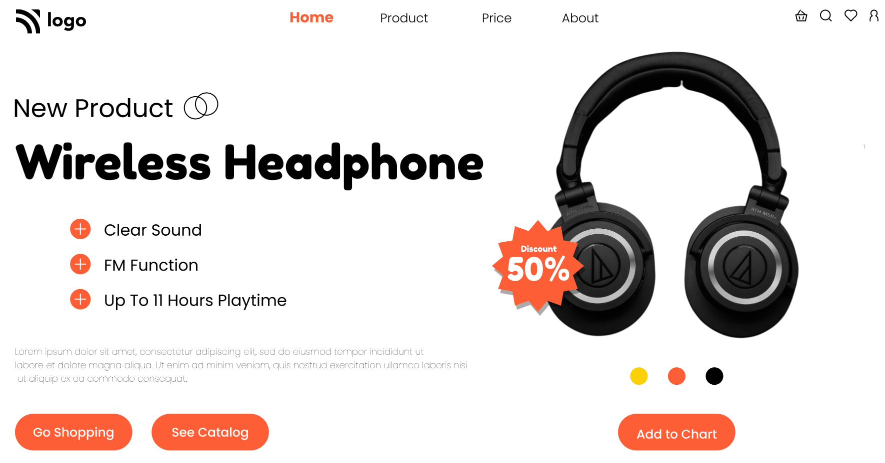

# Wireless Headphone Landing Page

**Welcome to the Wireless Headphone Landing Page project! This project is designed to give you a brief overview of the design and development process of creating a landing page for wireless headphones.**

## Brief Overview
This project focuses on the use of CSS position property and adding shadow to SVG images. The project duration is approximately **1.30 hours**.

## Skills learned
* CSS position property
* Adding shadow to SVG images

## Project duration
 -1.30 hours
 
Thank you for checking out the Wireless Headphone Landing Page project. We hope you found it informative and useful in learning about web design and development.
